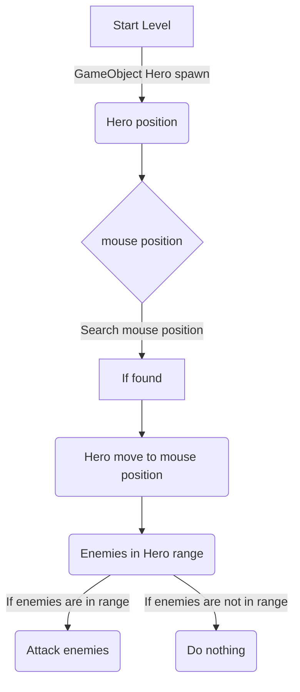

# TowerDefenseGame2.0
## In mijn Tower Defense game moet je het eindpunt beschermen, zodat de vijanden het eindpunt niet bereiken. Dat kan je doen met torens die je kan plaatsen met geld, wanneer je geen geld hebt kan je geld krijgen van de vijanden die je doodt.
##### Wave system: We moeten een systeem maken dat vijanden spawned wanneer er een wave bezig is, wanneer er geen wave bezig is moet het stoppen met spawnen. Na een aantal seconden moet het weer spawnen met vijanden. In het begin had ik ervoor gezorgd dat er 3 verschillende vijanden spawnen constant om de 3 seconden bijvoorbeeld, hiervoor had ik een YouTube filmpje gerbuikt om het spawnen uit te leggen. Daarna had ik het voor een lange tijd laten liggen, omdat ik niet wist hoe ik verder moest. Ik had het op meerdere manieren geprobeerd en ze lukten niet allemaal, sinds het zou ervoor zorgen dat er veel vijanden zouden spawnen waardoor de game lagden. In het eind heeft een vriend mij kunnen helpen om een systeem te maken. Nu kan de wave systeem een pauze hebben en dan wanneer de pauze 0 is, spawnen de vijanden voor 30 seconden bijvoorbeeld. Wanneer de 30 seconden 0 is stopt de functie met vijanden spawnen en is er een pauze van 15 seconden. En zo gaat het door in een loop.

