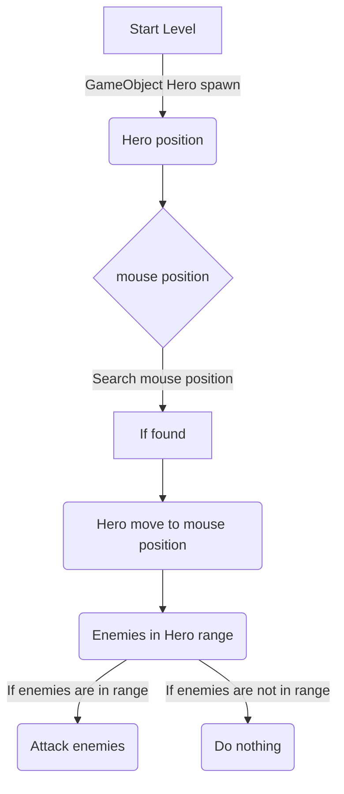

# TowerDefenseGame2.0
## In mijn Tower Defense game moet je het eindpunt beschermen, zodat de vijanden het eindpunt niet bereiken en jij niet verslagen wordt. Dat kan je doen met torens die je kan plaatsen met geld, wanneer je geen geld hebt kan je geld krijgen van de vijanden die je doodt. Op het eind van een level krijg je altijd een boss battle, wanneer de boss het eindpunt bereikt en jouw HP is 0 ben je verslagen. Als je de boss weet te verslaan win je de level.
##### Wave system: We moeten een systeem maken dat vijanden spawned wanneer er een wave bezig is, wanneer er geen wave bezig is moet het stoppen met spawnen. Na een aantal seconden moet het weer spawnen met vijanden. In het begin had ik ervoor gezorgd dat er 3 verschillende vijanden spawnen constant om de 3 seconden bijvoorbeeld, hiervoor had ik een YouTube filmpje gerbuikt om het spawnen uit te leggen. Ik had daarna meerdere manieren geprobeerd om ervoor te zorgen dat het wave systeem zou werken, bijvoorbeeld struct's. Struct's zijn een soort bank waarin je date kan opslaan. Hiermee waar ik ervoor zorgen dat je de data uit de bank kan oproepen en gebruiken in het systeem. Maar hierdoor zou de game breken en niet goed werken. Ik heb het toen aan een vriend gevraagd of hij mij kon helpen, samen met hem hebben we een wave systeem gemaakt die goed werky en niet de game zou breken. Nu kan de wave systeem een pauze hebben en dan wanneer de pauze 0 is, spawnen de vijanden voor 30 seconden bijvoorbeeld. Wanneer de 30 seconden 0 is stopt de functie met vijanden spawnen en is er een pauze van 15 seconden. Zo zou het telkens doorgaan totdat de boss of jij zelf doodt bent in de laatste wave.

